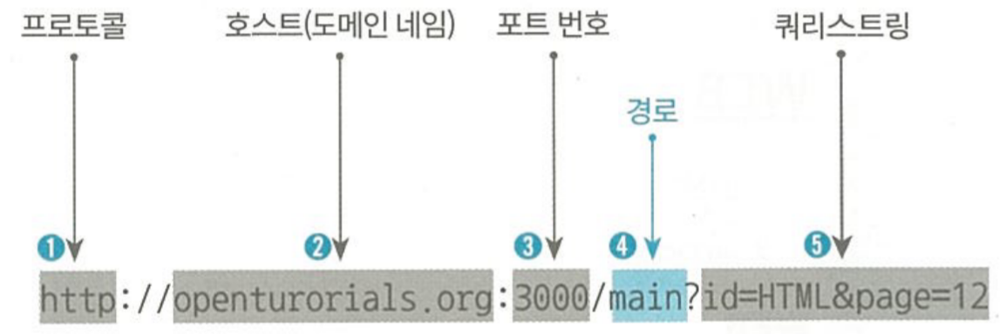

# [1장] 자바스크립트와 Node.js (1~27)

## 1.2. Node.js를 배우는 이유
- Node.js는 <u>사용자가 웹 페이지를 요청할 때마다 실시간으로 웹 페이지를 생성</u>
- 기존 웹 개발에서는 정적인 HTML 파일을 제공했지만, Node.js를 사용하면 <u>사용자의 요청에 따라 동적으로 웹 페이지를 생성</u>
- 웹 사이트에 방문하는 사용자에게 콘텐츠의 <u>읽기/쓰기/수정/삭제 작업을 제공</u>


## 1.3. Node.js 설치
### 1) Node.js의 동작 환경
  
|**Node.js 애플리케이션**|
|--|
|**자바스크립트**|
|**Node.js 런타임**|

웹 애플리케이션이 웹 브라우저 위에서 작동하는 것처럼 **Node.js 애플리케이션**은 ‘**Node.js 런타임**’이라는 프로그램 **위에서 작동**  
➡️ 가장 먼저 Node.js 런타임을 설치해야 함
### 2) Node.js 동작 방법
1. `Atom`을 이용해 자바스크립트 언어로 내용 작성
2. 터미널에서 `node [파일명].js`을 입력하여 파일 실행

## 1.5. Node.js 웹 서버 만들기
- Node.js는 웹 서버 기능으 내장하고 있어서 웹 서버로 사용 가능함
- Node.js를 웹 서버로 만들어주는 코드
    ```javascript
    //main.js

    var http = require('http');
    var fs = require('fs');
    var app = http.createServer(function(request, response) {
        var url = request.url;
        if(request.url == '/') {
            url = '/index.html';
        }
        if(request.url == '/favicon.ico') {
            return response.writeHead(404);
        }
        response.writeHead(200);
        response.end(fs.readFileSync(__dirname + url)); // 웹 서버가 웹 브라우저의 요청에 응답하는 명령

    });
    app.listen(3000);
    ```
    - `response.end()`: 웹 서버가 웹 브라우저의 요청에 <u>**응답**</u>하는 명령. 해당 괄호 안에 어떤 내용을 작성하느냐에 따라 웹 서버의 응답 내용이 달라짐!
- 터미널에서 `node main.js` 입력 후, `localhost:3000`에 접속하면 서버가 실행되는 걸 알 수 있음
> ➡️ main.js 파일을 작성하고 실행해서 Node.js를 웹 서버로서 동작하게 하고 웹 브라우저로 해당 웹 서버에 있는 웹 페이지를 불러옴


## 1.6. 자바스크립트 문법 - 데이터 타입
- 숫자형: Number
- 문자열: String

## 1.7. 자바스크립트 문법 - 변수

⭐ 첫 글자로 숫자 사용X, 대소문자 구문, 특수문자는 _와 $만 가능


## 1.8. 자바스크립트 문법 - 템플릿 리터럴
- HTML 페이지에 대한 템플릿을 리터럴로 간주, 변수에 선언하여 사용하는 것
- 템플릿 리터럴을 나타낼 때에는 아래와 같은 방법 이용
    > \`문자열을 작성하다가 ${**변수만 여기 안에 작성**}


## 1.9. Node.js - URL 이해하기
- 하나의 파일로 여러 개의 동적인 웹 페이지를 만들어서 보여줌
### URL의 다섯 가지 요소

1. **프로토콜**: 사용자가 서버에 접속할 때 어떤 방식으로 통신할 것인지를 나타내는 부분
2. **호스트(도메인 네임)**: 인터넷에 접속된 각각의 컴퓨터
3. **포트 번호**: 한 대 의 컴퓨터 안에 여러 서버가 있는데, 명시된 포트로 연결된 서버와 통신하게 됨 (포트번호를 생략하면 자동으로 80번 포트로 간주)
4. **경로**: 해당 컴퓨터 안에 있는 어떤 디렉터리의 어떤 파일을 불러올 것인지를 명시
5. **쿼리 스트링**: 물음표로 시작하고, 값과 값 사이는 &기호로 구분


## 1.10. Node.js - URL로 입력된 값 사용하기
### 1) 쿼리스트링 추출하기
```javascript
var http = require('http');
var fs = require('fs');
var url = require('url'); // url 모듈을 요청
var app = http.createServer(function(request, response) {
    var _url = request.url;
    var queryData = url.parse(_url, true).query;    // 문자열(_url = url주소가 담긴 문자열) 중에서 쿼리스트링만 추출해 객체로 반환
    if(_url == '/') {
        _url = '/index.html';
    }
    if(_url == '/favicon.ico') {
        return response.writeHead(404);
    }
    response.writeHead(200);
    response.end(fs.readFileSync(__dirname + url)); // 웹 서버가 웹 브라우저의 요청에 응답하는
});
app.listen(3000);
```
- `require('모듈명')`: Node.js의 특정 모듈을 요청
- `url.parse(_url, true).query`
: 문자열(_url = url주소가 담긴 문자열) 중에서 쿼리스트링만 추출해 객체로 반환

### 2) 쿼리스트링으로 요청한 값에 따라 다르게 응답하기
```javascript
var http = require('http');
var fs = require('fs');
var url = require('url'); // url 모듈을 요청
var app = http.createServer(function(request, response) {
    var _url = request.url;
    var queryData = url.parse(_url, true).query;    // 문자열(_url = url주소가 담긴 문자열) 중에서 쿼리스트링만 추출해 객체로 반환
    if(_url == '/') {
        _url = '/index.html';
    }
    if(_url == '/favicon.ico') {
        return response.writeHead(404);
    }
    response.writeHead(200);
    response.end(queryData.id) //queryData의 id요소를 응답
});
app.listen(3000);
```
- 해당코드에서 `http://localhost:3000/?id=HTML`을 입력하면 HTML이, `http://localhost:3000/?id=CSS`을 입력하면 CSS이 응답


## 1.11. App - 동적인 웹 페이지 만들기
- 쿼리 스트링에 따라 웹 페이지를 다르게 표시
- 템플릿 리터럴 이용
### 1) 쿼리 스트링에 따라 동적인 페이지 표시
```javascript
var http = require('http');
var fs = require('fs');
var url = require('url');
var app = http.createServer(function(request, response) {
    var _url = request.url;
    var queryData = url.parse(_url, true).query;
    if(_url == '/') {
        _url = '/index.html';
    }
    if(_url == '/favicon.ico') {
        return response.writeHead(404);
    }
    response.writeHead(200);

    // 리터럴 템플릿 작성, queryData.id에 따라 동적으로 변할 수 있도록
    var template = `
    <!doctype html>
    <html>
      <head>
        <title>WEB1 - ${queryData.id}</title>
        <meta charset="utf-8">
      </head>
      <body>
        <h1><a href="index.html">WEB</a></h1>
        <ol>
          <li><a href="/?id=HTML">HTML</a></li>
          <li><a href="/?id=CSS">CSS</a></li>
          <li><a href="/?id=JavaScript">JavaScript</a></li>
        </ol>
        <h2>${queryData.id}</h2>
        <p><a href="https://www.w3.org/TR/html5/" target="_blank" title="html5 speicification">Hypertext Markup Language (HTML)</a> is the standard markup language for <strong>creating <u>web</u> pages</strong> and web applications.Web browsers receive HTML documents from a web server or from local storage and render them into multimedia web pages. HTML describes the structure of a web page semantically and originally included cues for the appearance of the document.
        
        </p><p style="margin-top:45px;">HTML elements are the building blocks of HTML pages. With HTML constructs, images and other objects, such as interactive forms, may be embedded into the rendered page. It provides a means to create structured documents by denoting structural semantics for text such as headings, paragraphs, lists, links, quotes and other items. HTML elements are delineated by tags, written using angle brackets.
        </p>
      </body>
    </html>
    `;
    response.end(template);
});
app.listen(3000);

```
- 아래처럼 hreft에 쿼리스트링을 포함하여 작성함으로서 정적인 페이지로 연결
    ```html
    <li><a href="/?id=HTML">HTML</a></li>
    <li><a href="/?id=CSS">CSS</a></li>
    <li><a href="/?id=JavaScript">JavaScript</a></li>
    ```


### 2) 경로에 따른 페이지 연결
```javascript
var http = require('http');
var fs = require('fs');
var url = require('url');
var app = http.createServer(function(request, response) {
    var _url = request.url;
    var queryData = url.parse(_url, true).query;
    var title = queryData.id;

    if(_url == '/') {
        title = 'Welcome';      // 루트경로라면 해야 할 것
    }
    if(_url == '/favicon.ico') {
        return response.writeHead(404);
    }
    response.writeHead(200);

    
    var template = `
    <!doctype html>
    <html>
      <head>
        <title>WEB1 - ${title}</title>
        <meta charset="utf-8">
      </head>
      <body>
        <h1><a href="/">WEB</a></h1>
        <ol>
          <li><a href="/?id=HTML">HTML</a></li>
          <li><a href="/?id=CSS">CSS</a></li>
          <li><a href="/?id=JavaScript">JavaScript</a></li>
        </ol>
        <h2>${title}</h2>
        <p><a href="https://www.w3.org/TR/html5/" target="_blank" title="html5 speicification">Hypertext Markup Language (HTML)</a> is the standard markup language for <strong>creating <u>web</u> pages</strong> and web applications.Web browsers receive HTML documents from a web server or from local storage and render them into multimedia web pages. HTML describes the structure of a web page semantically and originally included cues for the appearance of the document.
        
        </p><p style="margin-top:45px;">HTML elements are the building blocks of HTML pages. With HTML constructs, images and other objects, such as interactive forms, may be embedded into the rendered page. It provides a means to create structured documents by denoting structural semantics for text such as headings, paragraphs, lists, links, quotes and other items. HTML elements are delineated by tags, written using angle brackets.
        </p>
      </body>
    </html>
    `;
    response.end(template);
});
app.listen(3000);
```
> ➡️ 이제 템플릿 리터럴을 이용하니까 이제 앞으로 html을 변경할 일이 생겨도 `main.js`파일만 건들면 해결 가능 !!!


## 1.12. Node.js - 파일 읽기
### 1) CRUD
: 정보시스템의 핵심적인 메커니즘

|CRUD |뜻|
|--|--|
|Create |생성 (* 가장 중요)|
|Read |읽기|
|Update |갱신|
|Delete |삭제|

### 2) 파일 읽기
```javascript
var fs = require('fs'); // 모듈을 불러옴
// read를 하기 위한 함수
fs.readFile('Sample.txt', 'utf8', function(err, data){
  console.log(data);
});
```
- fs모듈: file system과 관련되어 있는 모듈


## 1.13. App - 파일을 읽어서 본문 구현
### 1) 파일명에 따라 본문도 저장된 내용으로 변경하기
- 파일명에 따른 본문이 `date/파일명`에 저장되어 있음
```javascript
var http = require('http');
var fs = require('fs');
var url = require('url');
var app = http.createServer(function(request, response) {
    var _url = request.url;
    var queryData = url.parse(_url, true).query;
    var title = queryData.id;

    if(_url == '/') {
        title = 'Welcome';
    }
    if(_url == '/favicon.ico') {
        return response.writeHead(404);
    }
    response.writeHead(200);
    // 'data/파일명'에 저장된 파일의 이름에 따라 본문이 다르게 표시되도록
    fs.readFile(`data/${title}`, 'utf8', function(err, description){
      var template = `
      <!doctype html>
      <html>
        <head>
          <title>WEB1 - ${title}</title>
          <meta charset="utf-8">
        </head>
        <body>
          <h1><a href="/">WEB</a></h1>
          <ol>
            <li><a href="/?id=HTML">HTML</a></li>
            <li><a href="/?id=CSS">CSS</a></li>
            <li><a href="/?id=JavaScript">JavaScript</a></li>
          </ol>
          <h2>${title}</h2>
          <p>${description}</p>
        </body>
      </html>
      `;
      response.end(template);
    });
});
app.listen(3000);
```
- `fs.readFile('data/${title}', 'utf8', function(err, description){}`: 불러온 파일에서 본문이 description 변수에 저장이 됨
> ➡️ `main.js` 파일을 수정했을 때에는 서버를 재시작해야 변경사항이 적용됐지만, `data 폴더에 있는 내용`은 페이지가 열릴 때마다 해당 파일을 다시 읽어서 화면에 표시하기 때문에 서버를 재시작하지 않아도 내용이 반영됨


## 1.18. 자바스크립트 문법 - 콘솔에서 입력받기
```javascript
var args = process.argv;
console.log(args);
```
- `process.argv`: process 모듈에서 argv라는 기능(➡️ 콘솔에서 입력값을 받기)
- 해당 경우에는 파일을 실행할 때 **맨 뒤에 입력값을 함께 명시**해야 함
    ```bash
    node main.js egoing
    ```
- 해당 파일의 실행 결과(= 변수 arg의 구성요소)
    ```bash
    ['/user/local/bin/node',
    '/Users/username/Desktop/main.js',
    'egoing']
    ```
    ➡️ 즉. `process.argv`를 통해 할당된 `args`는 배열  
    **[parameters]**
    1. 런타임이 위치한 경로
    2. 실행한 파일이 위치한 경로
    3. 프로그램을 실행할 때 입력한 값 ⭐ 변수의 세 번째 parameter부터 입력값임


## 1.19. App - 오류 페이지와 홈페이지 구현
### 1) 미리 지정해두지 않은 경로로 접속했을 때 오류 페이지를 구현
```javascript
var http = require('http');
var fs = require('fs');
var url = require('url');
var app = http.createServer(function(request, response) {
    var _url = request.url;
    var queryData = url.parse(_url, true).query;
    var pathname = url.parse(_url, true).pathname; // 사용자가 입력한 URL 정보 중 경로 이름만 추출해 저장
    var title = queryData.id;

    // 루트경로로 접속했을 때
    if (pathname === '/'){
      fs.readFile(`data/${title}`, 'utf8', function(err, description){
        var template = `
        <!doctype html>
        <html>
          <head>
            <title>WEB1 - ${title}</title>
            <meta charset="utf-8">
          </head>
          <body>
            <h1><a href="/">WEB</a></h1>
            <ol>
              <li><a href="/?id=HTML">HTML</a></li>
              <li><a href="/?id=CSS">CSS</a></li>
              <li><a href="/?id=JavaScript">JavaScript</a></li>
            </ol>
            <h2>${title}</h2>
            <p>${description}</p>
          </body>
        </html>
        `;
        response.writeHead(200);
        response.end(template);
    }
    // 루트경로가 아닌 경로로 접속했을 때 에러창 띄우기
    else{
      response.writeHead(404);  // 요청한 파일이 없다는 응답코드
      response.end('Not Found');
    }
});
app.listen(3000);
```
- `var pathname = url.parse(_url, true).pathname;`: 사용자가 입력한 URL 정보 중 경로 이름만 추출해 저장
- `if else`문을 이용해 루트경로 접속하지 않았을 때의 행동을 추가
- 응답코드
    - `response.writeHead(200);`: 파일을 성공적으로 요청했다는 뜻
    - `response.writeHead(404);`: 요청한 파일이 없다는 뜻

### 2) 홈 페이지(초기 페이지)인지 아닌지 구분
```javascript
// require(): 해당 모듈을 요청
var http = require('http');
var fs = require('fs');
var url = require('url');

var app = http.createServer(function(request, response) {
    var _url = request.url;
    var queryData = url.parse(_url, true).query;  // 문자열(_url = url주소가 담긴 문자열) 중에서 쿼리스트링만 추출해 객체로 반환
    var pathname = url.parse(_url, true).pathname; // 사용자가 입력한 URL 정보 중 경로 이름만 추출해 저장

    // ① 루트경로로 접속했을 때
    if (pathname === '/') {
        // ② 쿼리스트링이 없을 때 (홈일 때)
        if (queryData.id === undefined) {
            var title = 'Welcome';
            var description = 'Hello, Node.js';
            var template = `
            <!doctype html>
            <html>
              <head>
                <title>WEB1 - ${title}</title>
                <meta charset="utf-8">
              </head>
              <body>
                <h1><a href="/">WEB</a></h1>
                <ol>
                  <li><a href="/?id=HTML">HTML</a></li>
                  <li><a href="/?id=CSS">CSS</a></li>
                  <li><a href="/?id=JavaScript">JavaScript</a></li>
                </ol>
                <h2>${title}</h2>
                <p>${description}</p>
              </body>
            </html>
            `;
            response.writeHead(200);
            response.end(template);
        }
        // ③ 쿼리스트링이 있을 때 (홈이 아닐 때)
        else {
            fs.readFile(`data/${queryData.id}`, 'utf8', function(err, description) {
                if (err) {
                    response.writeHead(404);
                    response.end('Not Found');
                    return;
                }
                var title = queryData.id;
                var template = `
                <!doctype html>
                <html>
                  <head>
                    <title>WEB1 - ${title}</title>
                    <meta charset="utf-8">
                  </head>
                  <body>
                    <h1><a href="/">WEB</a></h1>
                    <ol>
                      <li><a href="/?id=HTML">HTML</a></li>
                      <li><a href="/?id=CSS">CSS</a></li>
                      <li><a href="/?id=JavaScript">JavaScript</a></li>
                    </ol>
                    <h2>${title}</h2>
                    <p>${description}</p>
                  </body>
                </html>
                `;
                response.writeHead(200);
                response.end(template);
            });
        }
    }
    // ④ 루트가 아닐 때
    else {
        response.writeHead(404);
        response.end('Not Found');
    }
});

app.listen(3000);

```
- 쿼리스트링이 있던 없던 첫 시작이 `/`이면 루트경로라고 함
- 루트경로 중에서 쿼리스트링이 있다 ➡️ 홈 페이지
- **but, 홈 페이지의 경우에는 파일을 읽어오는 코드가 필요 없으므로 `fs.readFile(...)` 부분을 제거함**


## 1.23. Node.js - 파일 목록 알아내기
```javascript
var testFolder = './data';
var fs = require('fs');

fs.readdir(testFolder, function(err, filelist) {
    console.log(filelist);
});
```
- `fs` 모듈의 `readdir` 함수를 이용하여 파일목록 알아내기


## 1.24. App - 글 목록 출력하기
➡️ data 디렉터리에 데이터를 추가했을 때 `<li>`를 따로 추가하지 않고 동적으로 관리하기
```javascript
// require(): 해당 모듈을 요청
var http = require('http');
var fs = require('fs');
var url = require('url');

var app = http.createServer(function(request, response) {
    var _url = request.url;
    var queryData = url.parse(_url, true).query;  // 문자열(_url = url주소가 담긴 문자열) 중에서 쿼리스트링만 추출해 객체로 반환
    var pathname = url.parse(_url, true).pathname; // 사용자가 입력한 URL 정보 중 경로 이름만 추출해 저장
    const testFolder = './data';
    // ① 루트경로로 접속했을 때
    if (pathname === '/') {
        // ② 쿼리스트링이 없을 때 (홈일 때)
        if (queryData.id === undefined) {
          fs.readdir(testFolder, function(err, filelist) {
            var title = 'Welcome';
            var description = 'Hello, Node.js';
            var list = '<ul>';
            var i=0;
            while (i <filelist.length){
              list = list + `<li><a href = "/?id=${filelist[i]}">${filelist[i]}</a></li>`;
              i += 1;
            }
            list = list + '</ul>'
            var template = `
              <!doctype html>
              <html>
                <head>
                  <title>WEB1 - ${title}</title>
                  <meta charset="utf-8">
                </head>
                <body>
                  <h1><a href="/">WEB</a></h1>
                  ${list}
                  <h2>${title}</h2>
                  <p>${description}</p>
                </body>
              </html>
            `;
            response.writeHead(200);
            response.end(template);
          });
        }
        // ③ 쿼리스트링이 있을 때 (홈이 아닐 때)
        else {
          fs.readdir(testFolder, function(err, filelist) {
            var list = '<ul>';
            var i=0;
            while (i <filelist.length){
              list = list + `<li><a href = "/?id=${filelist[i]}">${filelist[i]}</a></li>`;
              i += 1;
            }
            list = list + '</ul>'
            fs.readFile(`data/${queryData.id}`, 'utf8', function(err, description) {
                if (err) {
                    response.writeHead(404);
                    response.end('Not Found');
                    return;
                }
                var title = queryData.id;
                var template = `
                <!doctype html>
                <html>
                  <head>
                    <title>WEB1 - ${title}</title>
                    <meta charset="utf-8">
                  </head>
                  <body>
                    <h1><a href="/">WEB</a></h1>
                    ${list}
                    <h2>${title}</h2>
                    <p>${description}</p>
                  </body>
                </html>
                `;
                response.writeHead(200);
                response.end(template);
            });
          });
        }
    }
    // ④ 루트가 아닐 때
    else {
        response.writeHead(404);
        response.end('Not Found');
    }
});

app.listen(3000);

```
- `readdir`로 파일목록 불러오고, `while` 이용해서 모든 파일에 대해 `<li><a href= ''></li>` 더한 걸 템플릿 리터럴에 할당


## 1.26. App - 함수 이용해 코드 정리하기
➡️ 해당 코드를 함수 이용해서 중복 제거하기
    - 템플릿 리터럴 부분
    - 파일 목록 알아내는 부분

## [최종 코드]
```javascript
// require(): 해당 모듈을 요청
var http = require('http');
var fs = require('fs');
var url = require('url');

function templateHTML(title, list, body) {
  return `
    <!doctype html>
    <html>
      <head>
        <title>WEB1 - ${title}</title>
        <meta charset="utf-8">
      </head>
      <body>
        <h1><a href="/">WEB</a></h1>
        ${list}
        ${body}
      </body>
    </html>
  `;
}

function templateList(filelist) {
  var list = '<ul>';
  var i = 0;
  while (i < filelist.length) {
    list = list + `<li><a href="/?id=${filelist[i]}">${filelist[i]}</a></li>`;
    i += 1;
  }
  list = list + '</ul>';
  return list;
}

var app = http.createServer(function(request, response) {
  var _url = request.url;
  var queryData = url.parse(_url, true).query;  // 문자열(_url = url주소가 담긴 문자열) 중에서 쿼리스트링만 추출해 객체로 반환
  var pathname = url.parse(_url, true).pathname; // 사용자가 입력한 URL 정보 중 경로 이름만 추출해 저장
  const testFolder = './data';

  // ① 루트경로로 접속했을 때
  if (pathname === '/') {
    // ② 쿼리스트링이 없을 때 (홈일 때)
    if (queryData.id === undefined) {
      fs.readdir(testFolder, function(err, filelist) {
        var title = 'Welcome';
        var description = 'Hello, Node.js';
        var list = templateList(filelist);
        var template = templateHTML(title, list, `<h2>${title}</h2><p>${description}</p>`);
        response.writeHead(200);
        response.end(template);
      });
    }
    // ③ 쿼리스트링이 있을 때 (홈이 아닐 때)
    else {
      fs.readdir(testFolder, function(err, filelist) {
        var list = templateList(filelist);
        fs.readFile(`data/${queryData.id}`, 'utf8', function(err, description) {
          if (err) {
            response.writeHead(404);
            response.end('Not Found');
            return;
          }
          var title = queryData.id;
          var template = templateHTML(title, list, `<h2>${title}</h2><p>${description}</p>`);
          response.writeHead(200);
          response.end(template);
        });
      });
    }
  }
  // ④ 루트가 아닐 때
  else {
    response.writeHead(404);
    response.end('Not Found');
  }
});

app.listen(3000);
```
