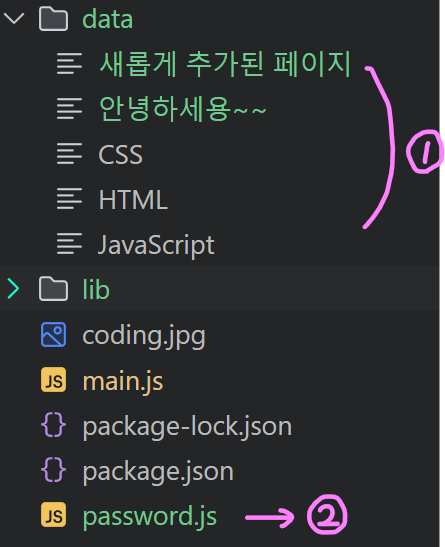

# [1장] 자바스크립트와 Node.js (28~48)

## 1.28. Node.js - 동기와 비동기 그리고 콜백
### 1) 동기와 비동기
- 동기(synchronous) 처리 방식: 하나의 작업이 끝날 때까지 기다렸다가 다음 작업이 처리하는 방식을 처리하는 방식 **(= 직렬)**
- 비동기(asynchronous) 처리 방식: 병렬로 동시에 여러 가지 일을 처리하는 방식 **(= 병렬)**  

**➡️ Node.js는 비동기 처리 방식으로 작동 가능**

### 2) Node.js에서 비동기 처리
- `Sync`가 <u>있으면</u> **동기 처리 방식**으로 동작
- `Sync`가 <u>없으면</u> **비동기 처리 방식**으로 동작

ex) `syntax/sample.txt`에 `B`란 텍스트가 있다고 해보자
1. 동기 처리 방식 (`readFileSync.(path, option)`)
    ```javascript
    var fs = require('fs');

    console.log('A');
    var result = fs.readFileSync('syntax/sample.txt', 'utf8');
    console.log(result);
    console.log('C');
    ```
    - 매개변수에 `callback`이 존재 X
    - `readFileSync`의 결과가 `result`에 담김
    - `readFileSync` <u>처리가 완료된 이후</u>에 `console.log('C')`가 실행
    > 실행 결과: **_A - B - C_**
2. 비동기 처리 방식 (`readFile.(path, option, callback)`)
    ```javascript
    var fs = require('fs');

    console.log('A');
    fs.readFile('syntax/sample.txt', 'utf8', function(err, result) {
        console.log(result);
    });
    console.log('C');
    ```
    - 매개변수에 `callback` 존재
    - **`readFile`은 아무 결과도 반환하지 않아서 직접 콜백함수를 작성해줘야 함**
    - `readFile` <u>처리가 완료되기 전</u>에 `console.log('C')`가 실행
    > 실행 결과: **_A - C - B_**

### 3) 콜백(Callback)
: 어떤 실행문을 마치면 내부적으로 자동 호출하는 기능  
ex) 언제 끝날지 모르는 함수의 실행이 끝날 때 자동으로 특정 함수를 호출
```javascript
function slowfinc(callback) {
    callback();
}
```
- 콜백을 매개변수로 받아서 호출
- `slowfunc()` 함수를 호출할 때 `slowfunc()`가 실행된 다음에 호출할 함수를 인수로 전달

## 1.29. Node.js - 패키지 매니저와 PM2
### 1) 패키지 매니저
- **패키지:** 소프트웨어를 일컫는 여러가지 표현 중 하나
- **패키지 매니저:** 패키지를 설치, 업데이트, 삭제하는 등 관리를 돕는 프로그램  

➡️ Node.js를 설치할 때 기본적으로 설치되는 패키지 매니저는 **npm**

### 2) PM2
: Node.js로 만든 프로세스를 관리해주는 프로그램  
- <u>PM2는 프로그램을 감시하고 있다가 의도하지 않게 꺼지거나 소스가 변경될 때 자동으로 재시동시킴</u>
- **프로세스**: 동작 중인 프로그램 (해당 프로젝트에선 `main.js`)
1. pm2 설치
    ```bash
    npm install pm2 -g
    ```
    > ⭐ pm2를 깔았는데도 실행되지 않으면 powershell 관리자모드에서 `Get-ExecutionPolicy`, `Set-ExecutionPolicy "RemoteSigned"` 입력하기, pm2 사용 다했으면 다시 `Set-ExecutionPolicy "Restricted"` 로 돌려두기
2. pm2 실행
    ```bash
    pm2 start [프로세스명]
    ```
3. 프로세스 감지
    ```bash
    pm2 monit
    ```
    - 현재 PM2가 감지하는 프로세스의 정보가 나타남
    - 사용자가 PM2를 강제종료해도 PM2가 프로세스를 자동으로 재시동시킴  
    ➡️ PM2는 이러한 기능을 통해 서**비스를 안정적으로 운영할 수 있게 해줌**
4. 프로세스 목록 확인
    ```bash
    pm2 list
    ```
5. 프로세스 중단
    ```bash
    pm2 stop [프로세스명]
    ```
6. ⭐ 소스 파일 감시
    ```bash
    pm2 start [프로세스명] --watch
    ```
    - 해당 방법으로 프로세스를 실행하면 소스코드 수정 후, 프로그램을 재시동하지 않고도 즉시 반영됨
7. 에러 발생 확인
    ```bash
    pm2 log
    ```  
    - 소스 파일이 변경될 때마다 감지 결과를 로그로 보여줌

> ⭐ 6번 코드로 PM2를 켜두면 **① 코드 수정 후 서버를 재실행하지 않고 새로고침해도 자동으로 반영**되고, **② 프로세스를 PM2에서 중단하지 않는 이상 서버가 중단되지 않으**니 유용함!! (대신 끝나면 프로세스 중단 시키기) ➡️ 그럼 이제 매번 따로 `node main.js` 입력해서 서버 실행시키지 않아도 됨
## 1.30. HTML - Form
### 1) 서버에서 데이터를 가져올 때 (GET)
```html
<from action="http://localhost:3000/process_create">
    <p><input type="text" name="title"></p>
    <p>
        <textarea name="description"></textarea>
    </p>
    <p>
        <input type="submit">
    </p>
</from>
```
- 위와 같이 HTML을 작성했을 때, `title`과 `description`에 입력한 내용이 쿼리스트링으로 전달됨  
- `method=get` 작성, 혹은 method를 아예 작성 X 

➡️ `http://localhost:3000/process_create?title=Hello&description=Hello`
### 2) 서버에 데이터를 전송할 때 (POST)
```html
<from action="http://localhost:3000/process_create" method=post>
    <p><input type="text" name="title"></p>
    <p>
        <textarea name="description"></textarea>
    </p>
    <p>
        <input type="submit">
    </p>
</from>
```
- 서버에 데이터를 전달할 때는 **눈에 보이지 않는 방식으로 전달**해야 함
- `method=post`를 작성
- POST 방식을 사용하면 데이터가 주소 표시줄에 나타나지 않아서 안전, 아주 큰 데이터도 전송 가능

➡️ `http://localhost:3000/process_create` 이런식으로 쿼리 스트링이 보이지 않음

### 정리
|method|상황|특징|
|--|--|--|
|"GET" / 생략 |서버에서 데이터를 가져올 때|쿼리 스트링이 URL에 표시 & 데이터 양 제한적|
|"POST"| 서버에 데이터를 전송할 때|쿼리 스트링이 URL에 표시 X  & 데이터 양 제한X|

## 1.31. App - 글 생성 UI 만들기
### 글 생성 버튼 생성 및 데이터 전달(POST)
```javascript
...
function templateHTML(title, list, body) {
  return `
    <!doctype html>
    <html>
      <head>
        <title>WEB1 - ${title}</title>
        <meta charset="utf-8">
      </head>
      <body>
        <h1><a href="/">WEB</a></h1>
        ${list}
        <a href="/create">create</a>
        ${body}
      </body>
    </html>
  `;
}
...
else if(pathname === '/create') {
      fs.readdir('./data', function(error, filelist) {
        var title = 'WEB - create';
        var list = templateList(filelist);
        var template = templateHTML(title, list, `
            <form action="http://localhost:3000/create_process" method="post">
                <p><input type="text" name="title" placeholder="title"></p>
                <p>
                    <textarea name="description" placeholder="description"></textarea>
                </p>
                <p>
                    <input type="submit">
                </p>
            </form>
        `);
        response.writeHead(200);
        response.end(template);
    });
```
- `create`버튼을 누르면 `pathname`이 `/create`가 되도록
- `pathname`이 `/create`이면 `form`이 생겨나도록
- 사용자가 입력한 데이터를 `create_process`로 전달

## 1.32. App - POST 방식으로 전송된 데이터 받기
- `create_process`로 전송된 데이터를 가져오는 방법
### 1) create-process 경로로 요청했을 때 처리하는 코드 추가
```javascript
...
function templateHTML(title, list, body) {
  return `
    <!doctype html>
    <html>
      <head>
        <title>WEB1 - ${title}</title>
        <meta charset="utf-8">
      </head>
      <body>
        <h1><a href="/">WEB</a></h1>
        ${list}
        <a href="/create_process">create</a>
        ${body}
      </body>
    </html>
  `;
}
...
else if(pathname === '/create_process') {
    response.writeHead(200);
    response.end('success');
  }
...
```
- `create` 버튼을 눌렀을 때 `create_process`로 요청 하기

### 2) querystring 모듈 추가
```javascript
...
var qs = require('qs');
...
```

### 3) POST 방식으로 정보 전달 받기
```javascript
...
var qs = require('qs');
...
else if(pathname === '/create_process') {
    var body = '';
    request.on('data', function(data) {

    });
    request.on('end', function() {
      
    });
  }  
...
```
- `request`는 `createServer` 함수의 콜백으로 전달한 인수임 ➡️ `var app = http.createServer(function(request, response) {}`
    - **`request`**: 요청할 때 _웹 브라우저가 보낸_ 정보
    - **`response`**: 응답할 때 _웹 브라우저에 전송할_ 정보
- `request.on('data', function(data) {});` : 데이터를 수신할 때마다 발생
    > ➡️ POST 방식으로 전송하는 데이터의 양이 많을 경우를 대비하여 <u>**데이터를 수신할 때 조각조각 나눠서 수신함**</u>
- `request.on('end', function() {});` : 데이터 수신을 완료하면 발생

### 4) POST로 전송된 데이터를 title, description 변수에 담기
```javascript
...
else if(pathname === '/create_process') {
        var body = '';
        // 데이터가 수신 될 동안 실행
        request.on('data', function(data) {
            body = body + data;
        });

        // 데이터 수신이 끝나면 실행
        request.on('end', function() {
            var post = qs.parse(body);
            var title = post.title;
            var description = post.description;
            console.log(title);
            console.log(description);
        });
        response.writeHead(200);
        response.end('success');
    }
...
```
## 1.33. App - 파일 생성과 리다이렉션
➡️ POST로 전송된 데이터를 변수가 아닌 파일 형태로 저장하기  

### 1) 데이터를 파일 형태로 저장하기

***파일에 데이터 쓰기 (`writeFile`)**
```javascript
fs.writeFile(file, data[, options], callback)
```
- param1 `file`: 파일명
- param2 `data`: 데이터
- *param3 `options`: 옵션 (인코딩 방식) **(필수 param X)**
- param4 `callback`: 콜백
---
```javascript
...
request.on('end', function() {
            var post = qs.parse(body);
            var title = post.title;
            var description = post.description;
            // 데이터를 파일에 저장
            fs.writeFile(`data/${title}`, description, 'utf8', function(err) {
                response.writeHead(200);
                response.end('success');
            });
        });
...
```
`fs.writeFile`에서 
- param1: `data` 디렉터리 아래의 `${title}`이 나타내는 값으로 파일 이름 지정
- param2: 파일에 쓸 내용은 description 그대로
- param3: 파일을 저장할 때 UTF-8 인코딩 방식 사용
- param4: 파일 쓰기를 마쳤을 때 에러를 처리하는 방법을 제공하는 콜백

### 2) 리다이렉션(redirection)
: <u>웹 페이지를 이동시키는 기능</u>
***http 모듈에서 HTTP 응답의 상태 코드와 헤더를 설정 (`writeHead`)**
```javascript
response.writeHead(statusCode[, statusMessage][, headers])
```
- param1 `statusCode`: 응답의 HTTP 상태 코드를 지정
    > **[statusCode]**  
        200: OK  
        301: 영구 이동 (요청한 페이지가 새 위치로 영구 이동, 클라이언트는 앞으로 새로운 URL을 사용)  
        302: 임시 이동 (요청한 페이지가 임시로 다른 위치로 이동)  
        404: Not Found  

    <u>➡️ 해당 경우에는 리다이렉션의 경우니까 *301* 또는 *302*로 설정</u>
- *param2 `statusMessage`: 상태 코드에 대한 설명 메시지 **(필수 param X)**
- *param3 `headers`: 응답 헤더를 설정 **(필수 param X)**
---
```javascript
fs.writeFile(`data/${title}`, description, 'utf8', function(err) {
    response.writeHead(302, {Location: `?id=${title}`});
    response.end('success');
});
```
- param1 `302`: 페이지를 다른 곳으로 리다이렉션
- param2 `Location`: 리다이렉션하고자 하는 경로

## 1.34. App - 글 수정 (수정 링크 생성)
- 1.33에서 작성된 글을 수정하기
### 1) 글 수정 화면으로 이동하는 링크 생성
```java
function templateHTML(title, list, body) {
    return `
    <!doctype html>
    <html>
        <head>
            <title>WEB1 - ${title}</title>
            <meta charset="utf-8">
        </head>
        <body>
            <h1><a href="/">WEB</a></h1>
            ${list}
            <a href="/create">create</a> <a href="/update">update</a>
            ${body}
        </body>
    </html>
    `;
}
```
- `templateHTML`에 `update` 기능 링크 추가
- but, 이러면 항상 `create`와 `update`가 보여지게 됨. 근데 **`update`는 어떤 글을 선택했을 때(= id가 있을 때)만 보여지게 하고 싶음**
### 2) 페이지의 목적에 맞게 링크 출력
```javascript
...
function templateHTML(title, list, body, control) {
    return `
    ...
        <body>
            <h1><a href="/">WEB</a></h1>
            ${list}
            ${control}
            ${body}
        </body>
    ...
    `;
}
...
if(pathname === '/') {
    ...
    if(queryData.id === undefined) {
        var template = templateHTML(title, list, `<h2>${title}</h2><p>${description}</p>`, `<a href="/create">create</a>`); // 홈에서는 create 버튼만
        ...
    });
    } else {
    ...
        var template = templateHTML(title, list, `<h2>${title}</h2><p>${description}</p>`, `<a href="/create">create</a> <a href="/update">update</a>`); // 상세 페이지에선 update 버튼도
            ....
            });
        });
        }
} else if(pathname === '/create') {
    fs.readdir('./data', function(error, filelist) {
        ...
        var template = templateHTML(title, list, `
            <form action="http://localhost:3000/create_process" method="post">
                <p><input type="text" name="title" placeholder="title"></p>
                <p>
                     <textarea name="description" placeholder="description"></textarea>
                </p>
                <p>
                    <input type="submit">
                </p>
            </form>
        `, ''); // 네 번째 인자를 공백으로
        ...
});
```
- `update`는 어떤 글을 선택했을 때(= id가 있을 때)만 보여지게 하고 싶어서 `templateHTML` 함수에 새로운 인자 `control` 추가
- `template` 함수를 사용하는 모든 곳에 네 번째 인자를 추가해주기
    - 홈(`QueryData.id === undefined`)에선 create 버튼만
    - 글 상세페이지(id가 있는 경우)에선 create버튼 + update 버튼
    - create가 이미 눌려져 있을 때는 create와 update가 모두 안보이도록

### 3) update 링크 클릭했을 때 id값을 쿼리스트링으로 제공
```javascript   
var template = templateHTML(title, list, `<h2>${title}</h2><p>${description}</p>`, `<a href="/create">create</a> <a href="/update?id=${title}">update</a>`);
```
- update링크를 클릭했을 때 이동할 페이지에 대한 id 값이 title인 쿼리 스트링 추가

## 1.35. APP - 글 수정 (수정할 정보 전송)
➡️ update 화면에서 수정한 내용을 서버로 전송
### 1) 경로가 update일 때 해당 파일 불러오고, 폼 에 채워넣기
```javascript
...
else if (pathname === '/update'){
      fs.readdir('./data', function(error, filelist) {
        var title = queryData.id;
        var list = templateList(filelist);
        var template = templateHTML(title, list, 
          `<form action="/update_process" method="post">
            <p><input type="text" name="title" placeholder="title" value="${title}"></p>
            <p><textarea name="description" placeholder="description">${description}</p>
            <p><input type="submit"></p>
          </form>
          `,
          `<a href="/create">create</a> <a href="/update?id=${title}">update</a>`
        );
        response.writeHead(200);
        response.end(template);
      });
}
...
```
- submit 버튼을 눌렀을 때 데이터를 전달할 경로를 `/update_process`로 지정
- 파일에서 읽어온 내용을 form에 삽입
### 2) 바뀌기 전 기존의 title 값을 hidden 타입의 `<input>` 태그에 지정
```javascript
...
var template = templateHTML(title, list,
    `
    <form action="/update_process" method="post">
        <input type="hidden" name="id" value="${title}">
        <p><input type="text" name="title" placeholder="title" value="${title}"></p>
        ...
)
```
- 기존 값을 저장하는 input을 하나 만들고, 사용자에게 보여지지 않게 `type="hidden"`으로 설정

## 1.36. App - 글 수정(수정된 내용 저장)
### 1) update_process 경로에 전달된 데이터를 가져와서 저장
```javascript
else if (pathname === '/update_process') {
        var body = '';
        request.on('data', function (data) {
            body += data;
        });
        request.on('end', function () {
            var post = qs.parse(body);
            var id = post.id;
            var title = post.title;
            var description = post.description;
            fs.rename(`data/${id}`, `data/${title}`, function (error) {
                ...
            });
        });
    }
```
- `fs.rename('data/${id}', 'data/${title}', function (error) {}`: fs 모듈의 `rename` 함수를 이용해 파일 이름을 변경
    - param1 `data/${id}`: 기존 파일명
    - param2 `data/${title}`: 변경 요청한 파일명
    - parma3 `function(err){}`: 에러가 발생했을 때 호출되는 콜백
### 2) rename 블록 안에서 내용을 수정하는 처리 구현
```javascript
...
fs.rename(`data/${id}`, `data/${title}`, function (error) {
    fs.writeFile(`data/${title}`, description, 'utf8', function (err) {
        response.writeHead(302, { Location: `/?id=${title}` });
        response.end();
    });
});
...
```
- `writeHead`를 통해 페이지를 다른 곳으로 리다이렉션, 리다이렉션 경로 지정

## 1.37. App - 글 삭제 (삭제 버튼 구현)

### 1) 글 목록 중 하나를 선택했을 때 delete 버튼 표시
```javascript
if(pathname === '/') {
        if(queryData.id === undefined) {
            ...
        } else {
            fs.readdir('./data', function(error, filelist) {
                fs.readFile(`data/${queryData.id}`, 'utf8', function(err, description) {
                    ...
                    var template = templateHTML(...
                        <a href="/delete?id=${title}">delete</a>`
                    );
                    ...
                });
            });
```
- `readFile`의 네 번째 인아에 delete 버튼을 추가해주기

### 2) 폼 버튼을 이용해 POST 방식으로 delete 작업 처리
- delete는 create나 update처럼 버튼 클릭 시 페이지가 이동하는 것이 아님 (delete는 바로 글이 삭제되어버림)
- delete는 반드시 GET 방식이 아닌 POST 방식으로 처리해야 함 (GET 방식은 클릭했을 때 브라우저의 주소창에 타이틀이 노출되어버려서 보안 사고가 발생 가능)

➡️ form 버튼을 이용해 POST 방식으로 처리해야 함
```javascript
var template = templateHTML(title, list,
...
<form>
    <input type="hidden" name="id" value="${title}">
    <input type="submit" value="delete">
</form>`
);
```
### 3) delete 버튼을 눌렀을 때 delete_process가 삭제 요청을 처리하도록
```javascript
var template = templateHTML(title, list,
...
<form action="delete_process" method="post">
    <input type="hidden" name="id" value="${title}">
    <input type="submit" value="delete">
</form>`
);
```
- 버튼을 눌렀을 떄 `http://localhost:3000/delete_process`으로 이동하도록
- POST 요청
- 삭제를 할 것인지 한 번 확인하게끔
    ```javascript
    <form action="delete_process" method="post" onsubmit="return confirm('정말로 삭제하시겠습니까?');">
    ```

## 1.38. App - 글 삭제 기능 완성
### 1) `/delete_process`에서 삭제 요청을 처리하는 작업 추가
```javascript
else if(pathname === '/delete_process') {
        var body = '';
        request.on('data', function(data) {
            body = body + data;
        });
        request.on('end', function() {
            var post = qs.parse(body);
            var id = post.id;
        });
} else
```
### 2) 파일 삭제 기능 구현 (`unlink`)
```javascript
fs.unlink(path, callback)
```
- param1: 삭제할 파일의 경로
- param2: 파일 삭제 작업이 완료된 후 호출될 콜백 함수
```javascript
request.on('end', function() {
    var post = qs.parse(body);
    var id = post.id;
    fs.unlink(`data/${id}`, function(err) {
        response.writeHead(302, {Location: '/'});
        response.end();
    });
});
```
- id값을 이용해 파일을 삭제할 경로를 전달, 콜백함수로 파일 삭제 완료 후 처리할 내용 작성
- 삭제가 끝난 다음에 사용자를 홈으로 보내기 위해 `writeHead` 사용

## 1.39~42. 자바스크립트 문법 - 객체
### 1) 객체
: 정보를 순서 없이 이름으로 식별하여 정리하여 보관하는 것
```javascript
var new_object = {
    'key1': 'value1',
    'key2': 'value2'
}
```
- 키-값 쌍을 저장함
- 값을 불러올 때는 `roles.key1` 또는 `roles['key1']`
### 2) 객체의 반복
- for문 : `for (var key in roles) {}`
    - 키에 접근) `key` 이용
    - 값에 접근) `roles[key]` 이용
### 3) 함수를 객체에 담아서 활용
**⭐ 자바스크립트에선 함수가 구문(statements)이면서 값(value)이기도 함**
- 즉, 함수는 값으로 취급하여 객체에 담아 사용할 수 있음
    ```javascript
    var o = {
        v1: 'v1',
        v2: 'v2',
        f1: function () { console.log(this.v1); },
        f2: function () { console.log(this.v2); }
    }
    ```
- 위와 같이 함수를 객체의 멤버로 선언하면 연관된 데이터와 함수를 하나의 객체로 묶어 정리정돈 할 수 있음
- 같은 이름의 함수더라도 어떤 객체에 저장된 함수냐에 따라서 다른 역할을 수행할 수도

## 1.43. App- 템플릿 기능 정리정돈하기
➡️ 서로 연관된 데이터와 함수를 객체로 묶어서 정리하기
### 1) `template` 객체 생성
```javascript
var template = {
    HTML: function(title, list, body, control){
        return `
        <!doctype html>
        <html>
            <head>
                <title>WEB1 - ${title}</title>
                <meta charset="utf-8">
            </head>
            <body>
                <h1><a href="/">WEB</a></h1>
                ${list}
                ${control}
                ${body}
            </body>
        </html>
        `;
    },
    list: function(filelist){
        var list = '<ul>';
        var i = 0;
        while(i < filelist.length) {
            list = list + `<li><a href="/?id=${filelist[i]}">${filelist[i]}</a></li>`;
            i = i + 1;
        }
        list = list+'</ul>';
        return list;
    }
}
```
- `templateHTML`와 `templateList` 함수를 `template`라는 객체에 담음
- 이제 `templateHTML`은 `template.HTML`, `templateList`은 `template.list`으로 변경하기

## 1.44. Node.js - 모듈의 형식
### 모듈
: 코드를 정리하는 가장 큰 도구
- 객체가 많아지면서 이 객체를 정리하는 더 큰 개념의 도구가 있어야 하는데, 그게 모듈
- 모듈을 만들어서 객체나 함수를 묶고, 이를 파일로 분리해서 외부에 독립적으로 공유

## 1.45. App - 모듈의 활용
➡️ `main.js`에 작성한 코드를 여러 파일로 분리(모듈화)하기
### 1) `template` 객체를 `template.js` 모듈로 분리하기
```javascript
module.exports = {
    HTML:function(title, list, body, control) {
        return `
        <!doctype html>
        <html>
            <head>
                <title>WEB1 - ${title}</title>
                <meta charset="utf-8">
            </head>
            <body>
                <h1><a href="/">WEB</a></h1>
                ${list}
                ${control}
                ${body}
            </body>
        </html>
        `;
    },
    list:function(filelist) {
        var list = '<ul>';
        var i = 0;
        while(i < filelist.length) {
            list = list + `<li><a href="/?id=${filelist[i]}">${filelist[i]}</a></li>`;
            i = i + 1;
        }
        list = list+'</ul>';
        return list;
    }
}
```
- `module.exports` : 현재 모듈의 특정 부분을 외부에서 사용할 수 있도록 내보내기

### 2) `main.js`에서 `template.js` 모듈을 불러오기
```javascript
var template = require('./lib/template.js');
```

## 1.46. App - 입력 정보에 대한 보안
> ❓create 버튼을 누르고, 새로 생성할 글의 타이들을 `../password.js`라고 설정하면?
- 아래 코드의 `queryData.id`가 `../password.js`가 되어 전혀 다른 파일에 접근하게 됨
    ```javascript
    fs.readdir('./data', function(error, filelist) {
        fs.readFile(`data/${queryData.id}`, 'utf8', function(err, description) {
    ``` 
- ①에 추가되어야 하는데, ②(`data/../password.js`)에 접근하게 됨

    </img>

➡️ 즉, `../`와 같은 것을 이용해 다른 디렉터리에 접근하는 것을 방지하기 위해 파일 이름만 따로 추출해내야 함

### 1) 경로 요청을 가져올 때
**경로 파싱하기(`path.parse(path)`)**
- `root`, `dir`, `base`, `ext`, `name`을 키로 하는 객체를 반환함
```javascript
var path = require('path');
...
else {
    fs.readdir('./data', function(error, filelist) {
        var filteredId = path.parse(queryData.id).base;     // 경로를 파싱하여 base 속성만 가져옴
        fs.readFile(`data/${filteredId}`,'utf8', function(err, descripton){});
    });
}
...
```
- 모든 경로 요청에 대해 `path.parse`로 필터링된 id를 불러오도록 수정하기!
