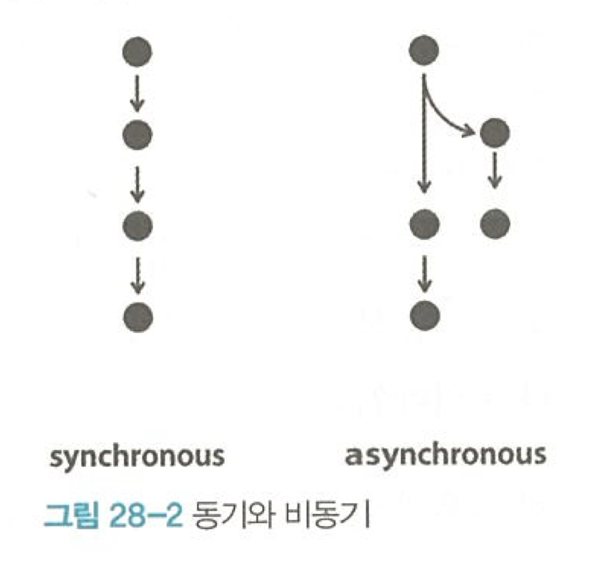

<!DOCTYPE html>
<html lang="ko">
<head>
    <meta charset="UTF-8">
    <meta name="viewport" content="width=device-width, initial-scale=1.0">
    <title>2주차 정리</title>
</head>
<body>
    <div id="28">
<h1>동기와 비동기 그리고 콜백</h1>
<ul>
    <li>동기 처리 방식 : 하나의 작업이 끝날떄까지 기다렸다가 다음 작업을 처리하는 방식.</li>
    <li>비동기 처리 방식 : 병렬로 동시에 여러 가지 일을 처리하는 방식</li>
</ul>   


<p>fs.readFile(path[,options],callback) vs fs.readFileSync(path,[,options]) </p>

```
var fs = require('fs');

// readFileSync

/* console.log('A');
var result = fs.readFileSync('syntax/sample.txt', 'utf8');
console.log(result);
console.log('C');
A B C */ 

console.log('A');
fs.readFile('syntax/sample.txt', 'utf8', function(err,result){
console.log(result);
});
console.log('C');

// A C B
```
- node.js가 파일을 읽는 작업이 끝나면, 함수를 실행시키면서 첫번째 인자에는 err  두번째 파라미터에는 인자로써 파일의 내용을 제공하는 것으로 약속되어 있음

- nodejs의 성능을 위해서는 비동기적인 코딩을 하는 것이 좋음

</div> 

<div id ="callback">
<h2>callback 실습</h2>
- callback : "파일을 읽은 후에 나중에 나를 불러"

```
/*
function a(){
    console.log('A');
}
a();
*/

var a = function(){
    console.log('A');
}
a();

function slowfunc(callback){
callback();
}

slowfunc();
// slowfunc라는 오랜시간이 걸려 실행되는 함수가 실행되고 callback이라는 파라미터는 a가 가리키는 함수를 가짐. 그래서 console.log('A')가 실행됨

```
</div>

<div>
<h2>Package Manager와 PM2</h2>
- Package = Software
- Package Manager : Package를 관리(생성,설치,업데이트,삭제..) : NPM
- PM2 : Production Process Manager for Node.js
<h5>다양한 pm2 명령어</h5>
pm2 monit
pm2 list
pm2 stop main
pm2 start main.js --watch
pm2 log
</div>
<div>
<h5>사용자가 컨텐츠를 웹을 통해 생성. 수정, 삭제할 수 있도록 하고자 함.</h5>
<h5> 사용자가 서버쪽으로 데이터를 전송하기 위한 html의 form</h5>
```
<form action="http://localhost:3000/process_create" method="post">
<p><input type="text" name ="title"></p>
<p>
    <textarea name="description"></textarea>
</p>
<p>
    <input type = "submit">
</p>
```
- form으로 input들을 감싸 데이터를 전송받음
- method="post"를 통해서 암호화하여 데이터를 전송

</div>

<div>
<h5> 글 생성 UI 만들기 </h5>
- form.html
```
<form action="http://localhost:3000/process_create" method="post">
<p><input type="text" name ="title"></p>
<p>
    <textarea name="description"></textarea>
</p>
<p>
    <input type = "submit">
</p>
```
1. main.js에 ceate  링크 생성 <a href ="/create">create</a>
2. if 문을 활용하여 pathname ==='/create' 이면 form.html 실행 (templateHTML 활용)

</div>

<div>
<h5> POST 방식으로 전송된 데이터 받기</h5>
request.on("이벤트")를 이용해서 웹브라우저로부터 post 방식으로 전송된 데이터를 받아올 수 있다.
```
 // (최상단에 추가) var qs = require("querystring");
  else if (pathname === '/create_process'){
    var body = ''

    request.on('data', function(data) {
      body = body + data;
    });
    request.on('end', function(){
      var post = qs.parse(body);
      var title = post.title;
      var description = post.description;
    });

    response.writeHead(200); 
    response.end('success');
  }
```
</div>
<div>
<h5>파일 생성과 리다이렉션</h5>
```
else if (pathname === '/create_process'){
    var body = ''
    request.on('data', function(data) {
      body = body + data;
    });
    request.on('end', function(){
      var post = qs.parse(body);
      var title = post.title;
      var description = post.description;
      fs.writeFile(`data/${title}`, description, 'utf8', function(err){
          response.writeHead(302, {Location: `/?id=${title}`}); 
          response.end();
      })
    });
}
```
- 파일 생성 : fs.writeFile(file,data,callback)
- 리다이렉션 : 사용자가 입력을 한 후 원래 페이지로 돌아가게 만듦 response.writeHead(302, {Location: 주소})
- 301: 영구 이동, 302: 임시 이동
</div>
<div>
<h5>글 수정(수정 링크 생성)</h5>
- 쿼리스트링이 있을 때에만 update/id=${title}으로 수정.
</div>

<div>
<h5>글 수정(수정할 정보 전송)</h5>
- <input type="hidden" name = "id" value = "${title}">을 통해 id값은 그대로 유지하고 그 정보를 사용자에게 보여주지 않음(hidden)
<h5>글 수정(파일명 변경, 내용저장)</h5>
- else if(pathname === '/update_proess'){"post 형식으로 받아온 데이터"}
- nodejs의 file rename : fs.rename(oldPath,newPath,callback)
- 예제에서 fs.rename(`data/${id}`,`data/${title}`, function(error){})
</div>
<div>
<h5>글 삭제 - 삭제버튼 구현</h5>
<form><input type = "hidden" name ="id" value = "${title}">
      <input type = "submit" value = "delete">
</form>
<form action = "delete_process" method="post" onsubmit = "안내문"> 
<h5>글 삭제 기능 완성</h5>
else if(pathname === 'delete_process'){
  fs.unlink(`data/${id}`,function(error))
}

</div>

</body>
</html>